## Log Analysis RAG System

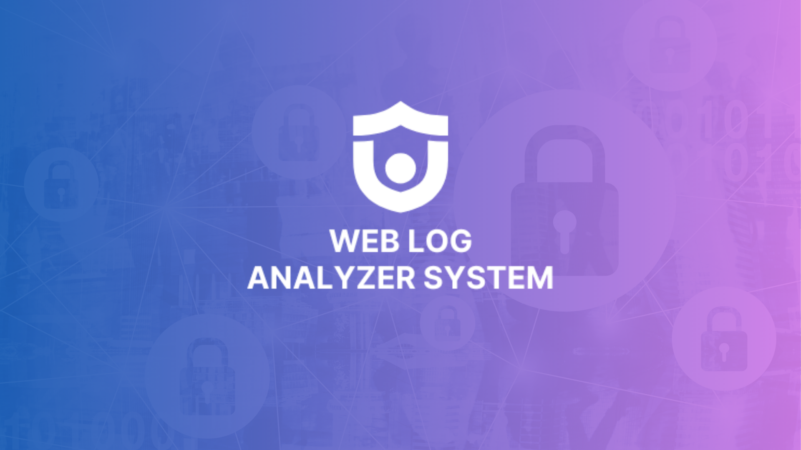

## Problem Overview

As we see in the large-scale LLM ecosystem, many companies use the power of AI to analyze and debug their log systems. This is mainly because log data is massive, complex, and difficult to investigate manually. Software engineering teams, large enterprises, and public or government organizations also require strict data privacy, which makes self-hosted or controlled AI-based log analysis systems essential.

- **LLM adoption**: 98% of organizations surveyed are adopting or have adopted LLM infrastructure, indicating near‑universal usage in technical environments.
- **Security automation**: Security teams using LLMs automate threat detection (e.g., ~49% in cybersecurity teams by 2026).
- **Modern log analysis**: ~55–70% of medium to large enterprises have or plan to adopt enhanced log analysis systems (with or without AI/LLMs) to support monitoring, reliability engineering, and compliance.

This project provides a self-hosted, privacy‑aware **LLM‑powered Log Analyzer** built on Retrieval‑Augmented Generation (RAG) to turn raw logs into actionable insights.

## High‑Level System Workflow

Everything begins when the user submits log files (application logs, server logs, or system logs) to the platform.

1. **Log Ingestion**

   - Users upload log files through the FastAPI backend.
   - The API receives the upload request and immediately delegates heavy processing tasks to Celery workers through RabbitMQ, which serves as the message broker between services.
   - This design keeps the API responsive while intensive operations are handled asynchronously.

2. **Preprocessing & Chunking**

   - Celery workers clean, normalize, and split large log files into smaller, meaningful chunks (by timestamp, service, IP, error pattern, or status code), making the data suitable for analysis.

3. **Embedding Generation**

   - Each log chunk is converted into a numerical vector using Ollama’s `nomic-embed-text:latest` embedding model.
   - These embeddings capture the semantic meaning of log messages, enabling the system to understand similarities between errors, warnings, and behavioral patterns instead of relying on simple keyword matching.

4. **Storage Layer**

   - The generated vectors are stored and indexed in a vector database (Qdrant / pgvector).
   - At the same time, structured metadata (log source, severity level, service name, IP, time window, processing status, etc.) is stored in PostgreSQL.

5. **Semantic Retrieval & Question Answering**

   - When the user submits a query—such as “Why did the service crash?” or “Show similar errors to this stack trace”—the system performs a semantic similarity search against the vector database to retrieve the most relevant log chunks.
   - The retrieved log context is then passed to Ollama’s `qwen2.5-coder:1.5b` language model.
   - The LLM analyzes the logs, correlates events, and generates clear, context‑aware explanations, potential root causes, or troubleshooting suggestions.

6. **Answer Delivery**

   - The final analyzed response is returned to the user through the FastAPI API, providing **actionable insights instead of raw log data**.

7. **Observability & Monitoring**
   - **Flower** monitors Celery workers and task execution in real time.
   - **Prometheus** collects system and application metrics.
   - **Grafana** visualizes performance, queue health, and resource usage.
   - This ensures full observability, reliability, and scalability of the Log Analyzer system.

### Architecture & Workflow Diagrams

- **End-to-end workflow**  
  

- **FastAPI + Nginx + Monitoring**  
  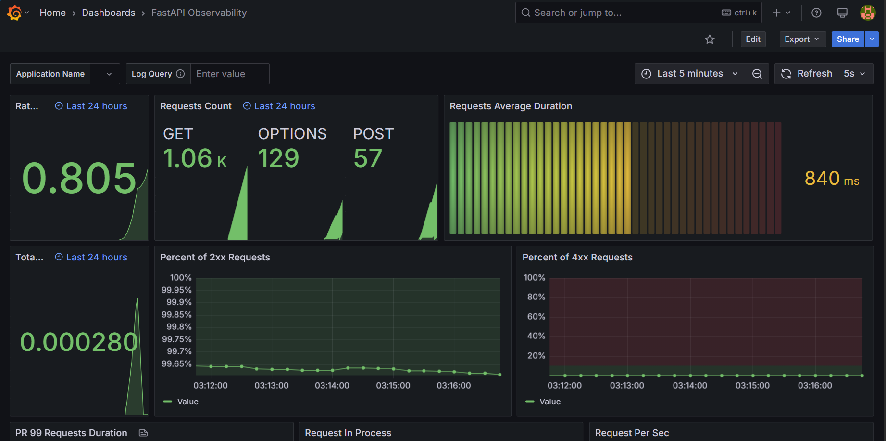

- **Dockerized infrastructure**  
  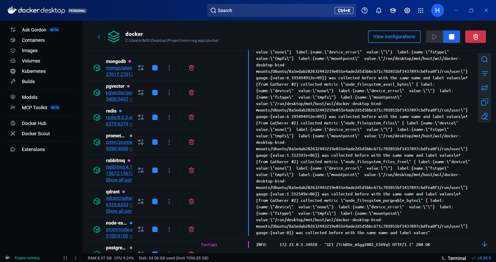

- **Database schema & assets**  
  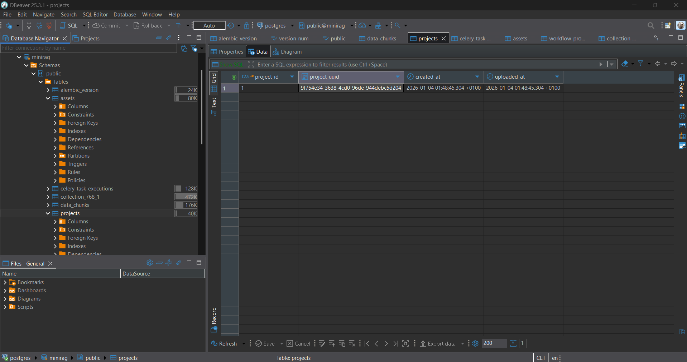  
  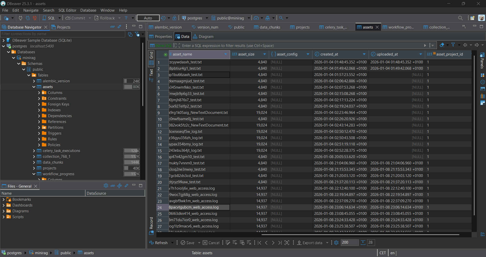  
  

- **Vector database observability**  
  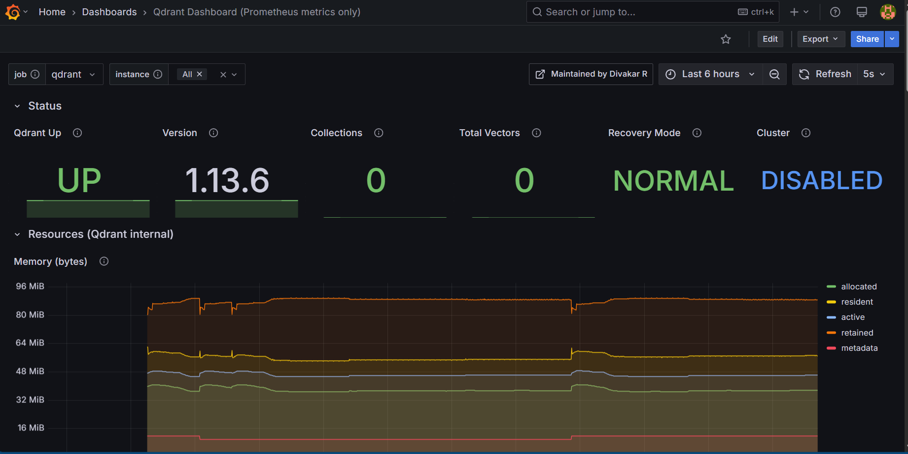

- **Celery & Flower monitoring**  
    
  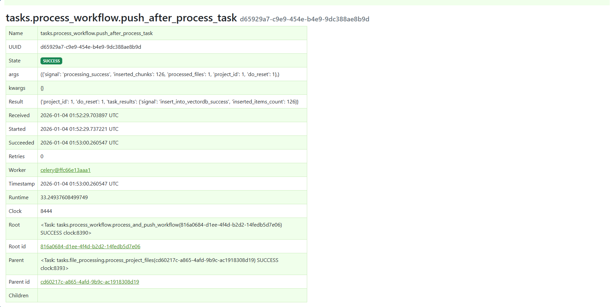  
    
  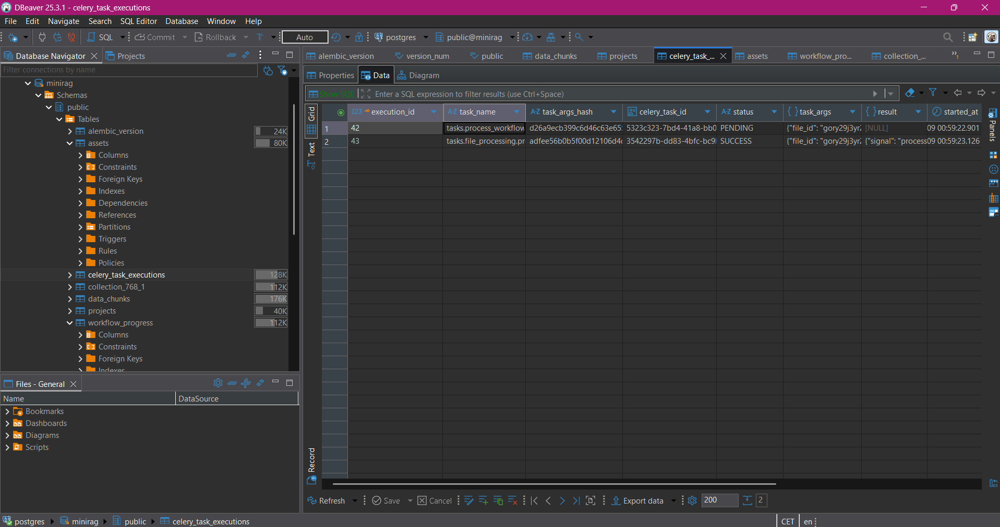

- **RabbitMQ management**  
  

- **Chunking & indexing views**  
  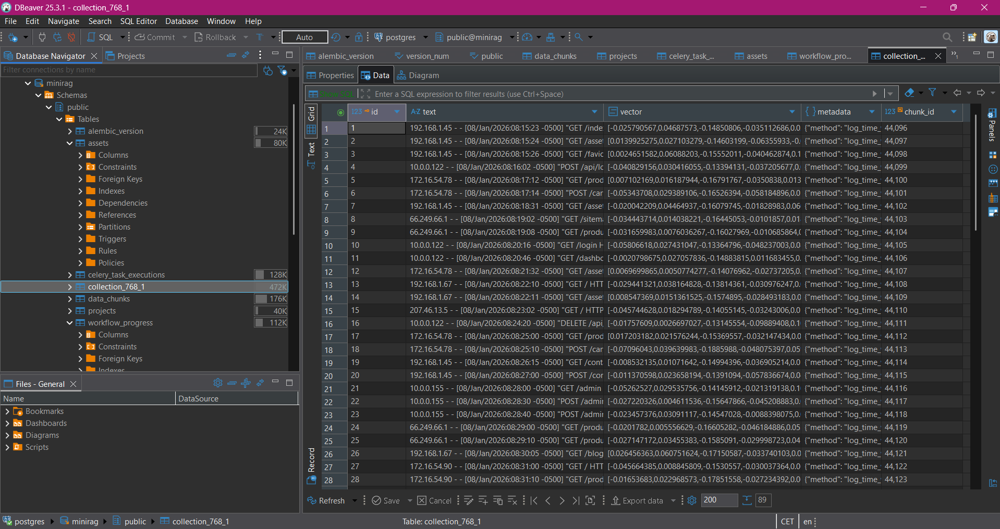  
  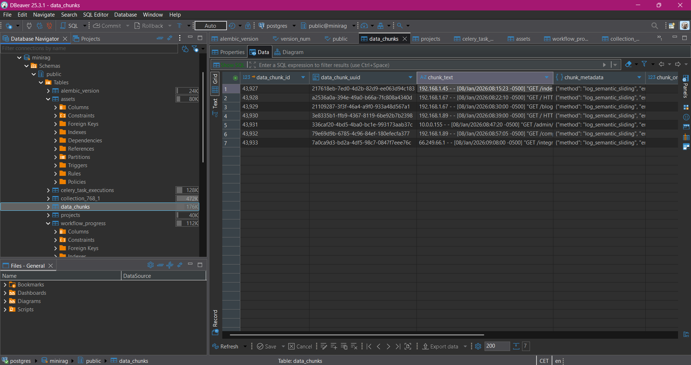  
  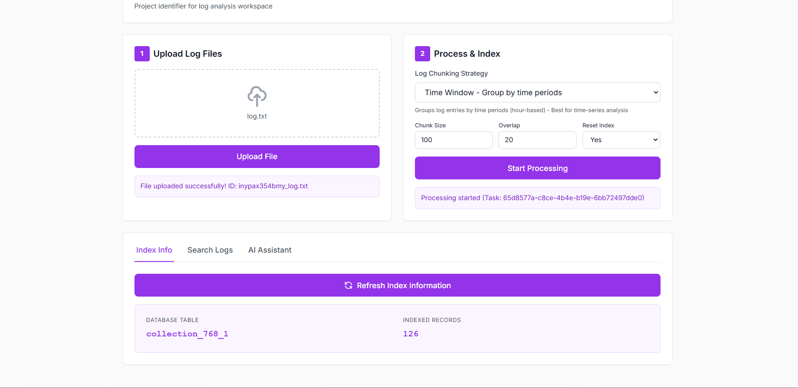

---

Retrieval Augmented Generation implementation for **log file question answering and analysis**. This project uses FastAPI, Celery, and various vector databases to provide a scalable and efficient RAG pipeline, optimized for local performance using Ollama as the LLM provider.

## Tools & Technologies

### Backend & API

- **Python 3.12**
- **FastAPI** – REST API for handling user requests
- **Uvicorn** – ASGI server

### LLM & AI

- **Ollama**
  - **`nomic-embed-text:latest`** – text embeddings generation
  - **`qwen2.5-coder:1.5b`** – large language model for answer generation

### Vector & Databases

- **Qdrant** – vector database for similarity search
- **PostgreSQL (pgvector)** – metadata and vector storage
- **SQLAlchemy & Alembic** – ORM and database migrations

### Asynchronous Processing

- **Celery** – background task processing
- **RabbitMQ** – message broker
- **Celery Beat** – task scheduling
- **Flower** – Celery monitoring

### Infrastructure & DevOps

- **Docker & Docker Compose** – containerization and service orchestration
- **Nginx** – reverse proxy

### Monitoring & Observability

- **Prometheus** – metrics collection
- **Grafana** – metrics visualization
- **Node Exporter** – system metrics
- **Postgres Exporter** – database metrics

### Testing & Development

- **Postman** – API testing
- **Git & GitHub** – version control

## Component Responsibilities

- **FastAPI**: Main entry point of the system. Handles user requests, file uploads, and search queries, and orchestrates communication with backend services.
- **Uvicorn**: ASGI server responsible for running the FastAPI application efficiently with high performance and async support.
- **RabbitMQ**: Message broker enabling reliable and asynchronous communication between FastAPI and Celery workers, allowing smooth horizontal scaling.
- **Celery Workers**: Execute background and long‑running tasks such as file processing, text/log chunking, and data indexing without blocking the API or degrading user experience.
- **Celery Beat**: Handles scheduled and periodic tasks such as cleanup jobs or recurring background processes.
- **Vector Databases (Qdrant / pgvector)**: Store and index embeddings generated from log chunks, enabling fast and accurate similarity search during retrieval.
- **Ollama – `nomic-embed-text:latest`**: Generates dense vector embeddings from text chunks, forming the foundation of semantic search.
- **Ollama – `qwen2.5-coder:1.5b`**: Generates context‑aware responses based on the most relevant retrieved chunks.
- **PostgreSQL**: Stores structured application data including metadata, project information, and task execution details.
- **SQLAlchemy & Alembic**: Provide ORM capabilities and database schema migrations to manage PostgreSQL efficiently.
- **Nginx**: Acts as a reverse proxy in front of the FastAPI application, improving security, routing, and performance.
- **Docker & Docker Compose**: Containerize and orchestrate all system services, ensuring consistent environments and simplified deployment.
- **Monitoring Stack**:
  - **Flower** – real‑time monitoring of Celery workers and task execution.
  - **Prometheus** – metrics collection.
  - **Grafana** – metrics visualization and dashboards.
  - **Node Exporter** – system‑level metrics.
  - **Postgres Exporter** – database metrics.
- **Postman**: Used for API testing and endpoint validation during development.
- **Git & GitHub**: Version control and source code management.

## Log Chunking Methods Evaluation (January 9, 2026)

This system includes multiple log‑specific chunking strategies for RAG, evaluated on a dataset of 150+ Apache web server log entries over a 65‑minute period (08:15:23–09:20:05, January 8, 2026). The dataset covers multiple IPs, HTTP methods (GET, POST, PUT, DELETE), and status codes (200, 304, 401, 403, 404) across static assets, APIs, product pages, admin, search, cart, and checkout flows.

### Chunking Methods: Technical Overview

- **Method 1 – `log_semantic_sliding`**

  - **Logic**: Sliding window over sequential log entries with 20% overlap to preserve context across chunk boundaries.
  - **Config**: `chunk_size = 2500` characters, `overlap = 20%`, average 8–15 log entries per chunk.
  - **Pros**: Strong temporal/context preservation, good for multi‑entry analysis and general RAG queries.
  - **Cons**: Slight storage overhead due to overlap, may mix unrelated entries for very focused queries.

- **Method 2 – `log_error_block`**

  - **Logic**: Detects error status codes (400, 401, 403, 404, 405, 500–504) and groups them with nearby non‑error context into blocks.
  - **Config**: `chunk_size = 2500`, `overlap = 0`.
  - **Pros**: Excellent for error analysis, debugging, and security incident investigation.
  - **Cons**: Less effective for non‑error queries; can fragment successful traffic patterns.

- **Method 3 – `log_time_window`**

  - **Logic**: Groups logs into fixed hourly windows using extracted timestamps (e.g., `2026-Jan-08_08:00`).
  - **Config**: `chunk_size = 3000`, `overlap = 0`, hourly granularity.
  - **Pros**: Ideal for temporal/traffic pattern analysis and peak‑hour identification.
  - **Cons**: May split related requests across hour boundaries; less suited for user‑centric queries.

- **Method 4 – `log_component_based`**

  - **Logic**: Groups logs by client IP address using regex on the line start.
  - **Config**: `chunk_size = 2500`, `overlap = 0`, component identifier = IP.
  - **Pros**: Great for client/user behavior analysis, session tracking, and suspicious activity detection.
  - **Cons**: Fragments time‑based patterns; multi‑IP queries require multiple chunks.

- **Method 5 – `log_status_code`**
  - **Logic**: Groups logs by HTTP status code categories (2xx success, 3xx redirect, 4xx client error, 5xx server error).
  - **Config**: `chunk_size = 2500`, `overlap = 0`.
  - **Pros**: Excellent for performance monitoring and error‑rate analysis.
  - **Cons**: Fragments user journeys and limits context to same‑status entries.

### Question–Answer Evaluation (Summary)

The methods were evaluated on multiple query types, including user journey analysis, error analysis, time‑based analysis, status code analysis, authentication failure patterns, and cart operations.

- **User journey & cart flows**:

  - `log_component_based` scored highest (9/10) by grouping all events for a given IP (e.g., full checkout for IP `172.16.54.78`, cart operations across users).
  - `log_semantic_sliding` provided good context but sometimes mixed users or missed parts of sequences.

- **Error & authentication analysis**:

  - `log_error_block` excelled (9/10) for listing 4xx errors, authentication failures, and grouping related error context.
  - `log_status_code` also performed well for summarizing error distributions.

- **Time‑based traffic patterns**:

  - `log_time_window` achieved 9/10 for analyzing traffic between 08:00 and 09:00, peak periods, and time‑localized behaviors.

- **Status distribution**:
  - `log_status_code` was best suited to compute percentages of 2xx/3xx/4xx responses and identify 404 endpoints, though full accuracy depends on covering the complete dataset.

### Comparative Scores (by Query Type)

| Query Type      | Semantic Sliding | Error Block | Time Window | Component‑Based | Status Code |
| --------------- | ---------------- | ----------- | ----------- | --------------- | ----------- |
| User Journey    | 7/10             | 4/10        | 6/10        | **9/10**        | 5/10        |
| Error Analysis  | 7/10             | **9/10**    | 6/10        | 7/10            | 8/10        |
| Time Patterns   | 7/10             | 5/10        | **9/10**    | 5/10            | 6/10        |
| Status Analysis | 7/10             | 6/10        | 6/10        | 6/10            | **8/10**    |
| Auth Failures   | 6/10             | **9/10**    | 6/10        | 8/10            | 7/10        |
| Cart Operations | 7/10             | 5/10        | 6/10        | **9/10**        | 5/10        |
| **Average**     | **7.0/10**       | 6.3/10      | 6.5/10      | **7.3/10**      | 6.5/10      |

### Recommendations

- **Best general‑purpose method**:
  - `log_semantic_sliding` is recommended for default RAG usage due to strong context preservation, balanced performance across all query types (7.0/10), and design optimized for retrieval‑augmented generation.
- **Best for specialized tasks**:
  - `log_error_block` – error analysis, security incidents, and authentication failures.
  - `log_time_window` – temporal/traffic pattern queries.
  - `log_component_based` – user journey, cart operations, and IP‑based behavior analysis.
  - `log_status_code` – performance monitoring and status‑code‑focused analytics.

This evaluation demonstrates that **no single chunking method is optimal for all query types**, and the system can select or combine strategies depending on the question type for more accurate log analysis.

---

## Installation

### 1. Clone the Repository

```bash
git clone https://github.com/MarouaHattab/mini-rag-app
cd mini-rag-app
```

### 2. Environment Setup

#### Option A: Local Development

**Create Virtual Environment**

```bash
python3 -m venv env
source env/bin/activate  # On Windows: env\Scripts\activate
```

**Install Dependencies**

```bash
cd src
pip install -r requirements.txt
```

**Configure Environment**

```bash
cd ../docker/env
cp .env.example.app .env.app
cp .env.example.postgres .env.postgres
cp .env.example.rabbitmq .env.rabbitmq
cp .env.example.redis .env.redis
cp .env.example.grafana .env.grafana
```

**Configure Ollama (Local LLM)**
This project is configured to use Ollama by default, removing the need for external API keys. Update your `.env.app` with the following:

```env
# LLM Configuration for local Ollama
GENERATION_BACKEND="OPENAI"
EMBEDDING_BACKEND="OPENAI"

# Use local Ollama endpoint (OpenAI compatible)
OPENAI_API_URL="http://host.docker.internal:11434/v1"
OPENAI_API_KEY="ollama"  # Placeholder value

# Model Selection
GENERATION_MODEL_ID="qwen2.5-coder:1.5b"
EMBEDDING_MODEL_ID="nomic-embed-text"
```

#### Option B: Docker-Only Setup

```bash
cd docker/env
# Copy all environment files
for file in .env.example.*; do cp "$file" "${file//.example/}"; done
# Update LLM configuration in .env.app as shown above
```

### 3. Database Setup

```bash
cd docker
docker compose up pgvector rabbitmq redis -d
```

**Run Migrations**

```bash
cd ../src/models/db_schemes/minirag
source ../../../../env/bin/activate  # If using local setup
alembic upgrade head
```

## Running the Application

### Using Docker Compose (Recommended)

```bash
cd docker
docker compose up --build
```

Services will be available at:

- FastAPI API: http://localhost:8000
- API Documentation: http://localhost:8000/docs
- Nginx (Load Balancer): http://localhost:81
- Flower (Celery Monitor): http://localhost:5555
- Grafana Dashboard: http://localhost:3000
- Prometheus Metrics: http://localhost:9090
- RabbitMQ Management: http://localhost:15672

### Local Development

**Terminal 1: Start services**

```bash
cd docker
docker compose up pgvector rabbitmq redis qdrant prometheus grafana -d
```

**Terminal 2: Start FastAPI**

```bash
cd src
source ../env/bin/activate
uvicorn main:app --reload --host 0.0.0.0 --port 8000
```

**Terminal 3: Start Celery Worker**

```bash
celery -A celery_app worker --queues=default,file_processing,data_indexing --loglevel=info
```

**Terminal 4: Start Flower (optional)**

```bash
celery -A celery_app flower --conf=flowerconfig.py
```

## API Usage

### 1. Upload Documents

```bash
curl -X POST "http://localhost:8000/data/upload/1" \
  -H "Content-Type: multipart/form-data" \
  -F "files=@document.pdf"
```


### 2. Process Documents

```bash
curl -X POST "http://localhost:8000/data/process/1"
```


### 3. Index for Search

```bash
curl -X POST "http://localhost:8000/nlp/index/push/1"
```

### 4. Search Documents

```bash
curl -X POST "http://localhost:8000/nlp/index/search/1" \
  -H "Content-Type: application/json" \
  -d '{"query": "What is the main topic?", "top_k": 5}'
```

### 5. Ask Questions (RAG)

```bash
curl -X POST "http://localhost:8000/nlp/index/answer/1" \
  -H "Content-Type: application/json" \
  -d '{"query": "Explain the main concepts in the document"}'
```


## API Testing

### Postman Collection

Import the Postman collection from `src/assets/mini-rag-app.postman_collection.json`

### Interactive Documentation

Visit http://localhost:8000/docs for Swagger UI documentation.


## Monitoring

### Grafana Dashboards

- URL: http://localhost:3000
- Default Credentials: admin / admin (configure in .env.grafana)
- Pre-configured Dashboards: System metrics, PostgreSQL metrics, application metrics


### Celery Task Monitoring

- Flower Dashboard: http://localhost:5555
- Password: Set in CELERY_FLOWER_PASSWORD environment variable


### Prometheus Metrics

- URL: http://localhost:9090
- Available Metrics: Application performance, database health, system resources


## Configuration

### Supported File Types

- PDF: .pdf
- Text: .txt
- Maximum file size: 10MB (configurable)

### Vector Databases

- **PostgreSQL + pgvector**: Default, integrated with main database.
- **Qdrant**: Dedicated vector database, better for large-scale deployments.
