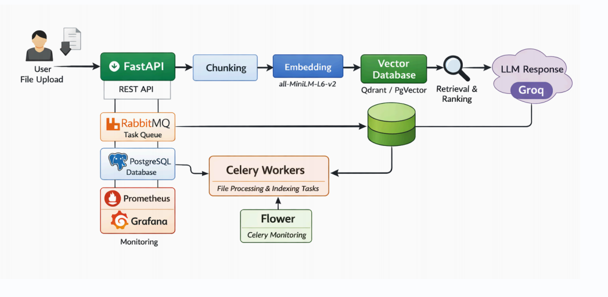
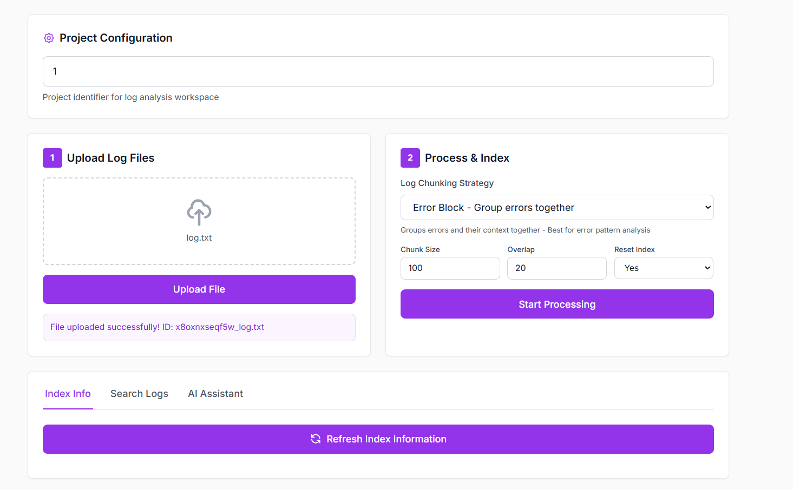
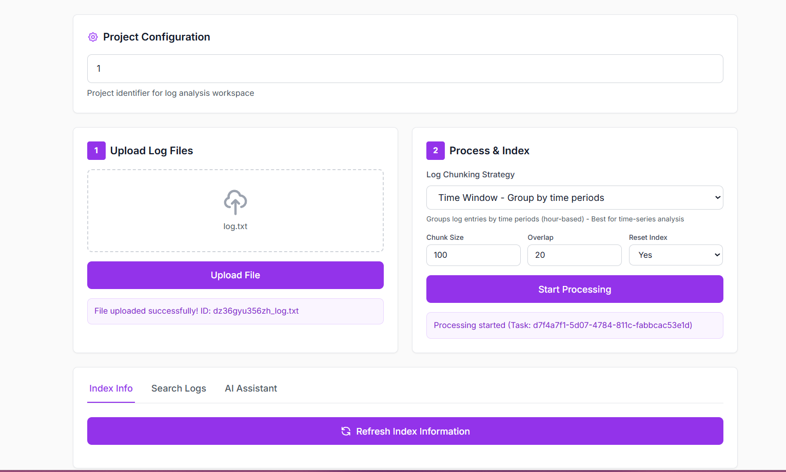
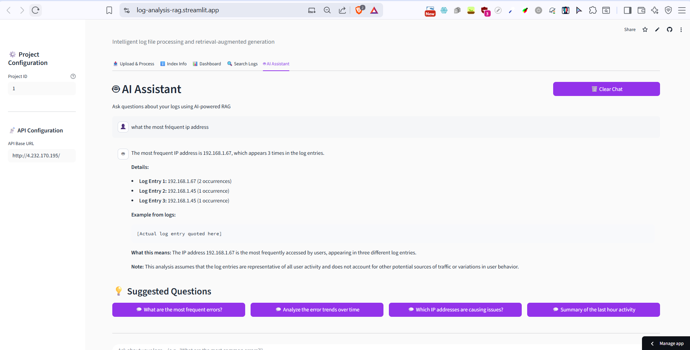
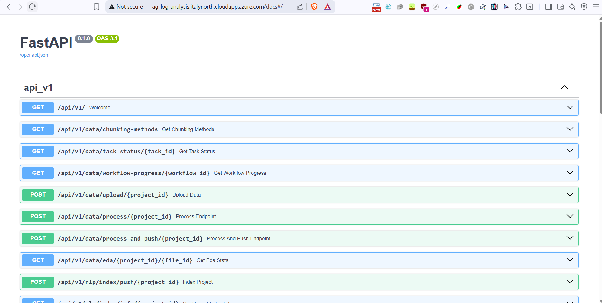
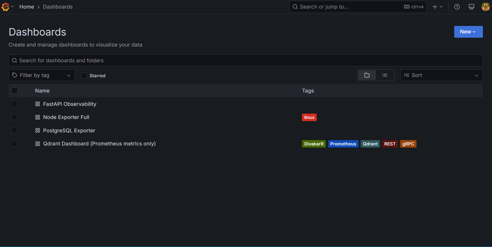
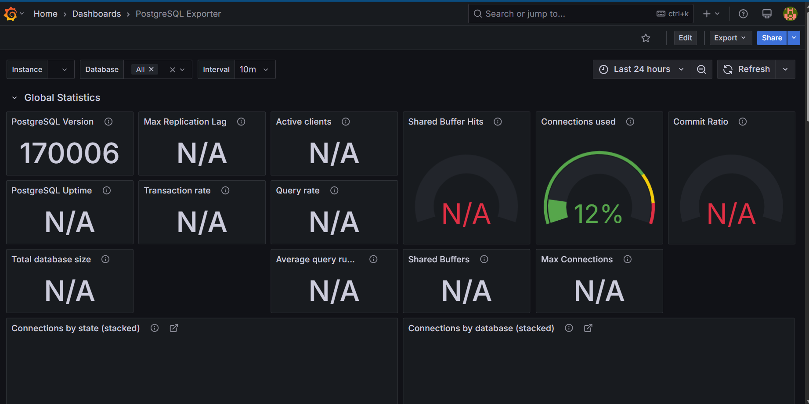
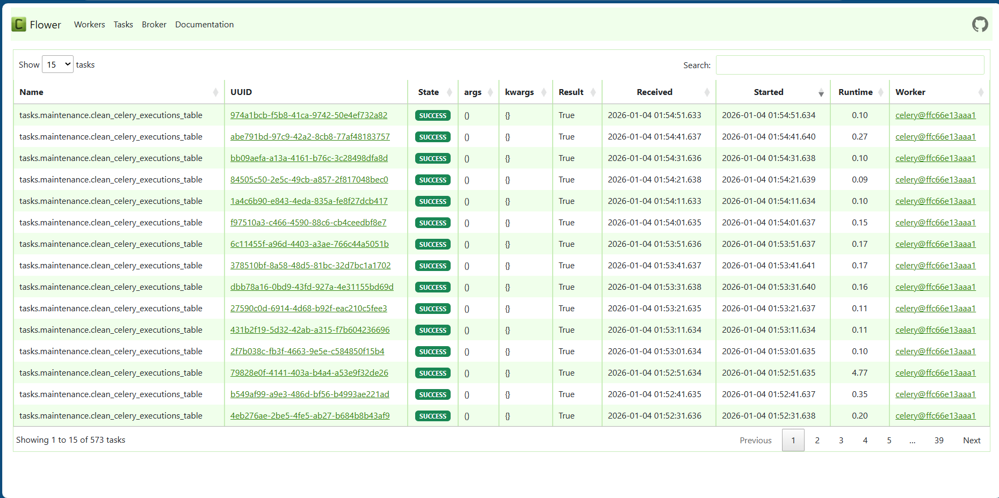
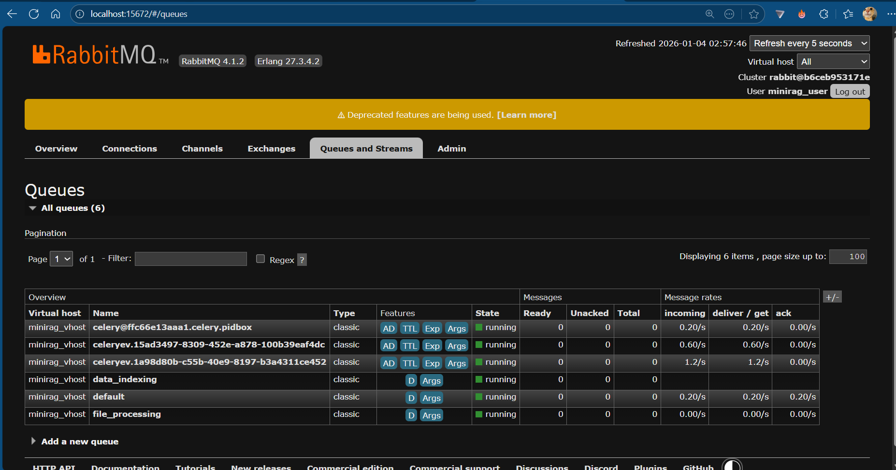

# Log Analysis RAG System

Retrieval Augmented Generation implementation for document question answering. This project uses FastAPI, Celery, and various vector databases to provide a scalable and efficient RAG pipeline. It is optimized for local performance using Ollama as the LLM provider.

## System Workflow

The following diagram explains the internal process from document ingestion to the final answer generation.



## Installation

### 1. Clone the Repository
```bash
git clone https://github.com/MarouaHattab/mini-rag-app
cd mini-rag-app
```

### 2. Environment Setup

#### Option A: Local Development

**Create Virtual Environment**
```bash
python3 -m venv env
source env/bin/activate  # On Windows: env\Scripts\activate
```

**Install Dependencies**
```bash
cd src
pip install -r requirements.txt
```

**Configure Environment**
```bash
cd ../docker/env
cp .env.example.app .env.app
cp .env.example.postgres .env.postgres
cp .env.example.rabbitmq .env.rabbitmq
cp .env.example.redis .env.redis
cp .env.example.grafana .env.grafana
```

**Configure Ollama (Local LLM)**
This project is configured to use Ollama by default, removing the need for external API keys. Update your `.env.app` with the following:

```env
# LLM Configuration for local Ollama
GENERATION_BACKEND="OPENAI"
EMBEDDING_BACKEND="OPENAI"

# Use local Ollama endpoint (OpenAI compatible)
OPENAI_API_URL="http://host.docker.internal:11434/v1"
OPENAI_API_KEY="ollama"  # Placeholder value

# Model Selection
GENERATION_MODEL_ID="qwen2.5-coder:7b"
EMBEDDING_MODEL_ID="nomic-embed-text"
```

#### Option B: Docker-Only Setup
```bash
cd docker/env
# Copy all environment files
for file in .env.example.*; do cp "$file" "${file//.example/}"; done
# Update LLM configuration in .env.app as shown above
```

### 3. Database Setup
```bash
cd docker
docker compose up pgvector rabbitmq redis -d
```

**Run Migrations**
```bash
cd ../src/models/db_schemes/minirag
source ../../../../env/bin/activate  # If using local setup
alembic upgrade head
```

## Running the Application

### Using Docker Compose (Recommended)
```bash
cd docker
docker compose up --build
```

Services will be available at:
- FastAPI API: http://localhost:8000
- API Documentation: http://localhost:8000/docs
- Nginx (Load Balancer): http://localhost:81
- Flower (Celery Monitor): http://localhost:5555
- Grafana Dashboard: http://localhost:3000
- Prometheus Metrics: http://localhost:9090
- RabbitMQ Management: http://localhost:15672

### Local Development

**Terminal 1: Start services**
```bash
cd docker
docker compose up pgvector rabbitmq redis qdrant prometheus grafana -d
```

**Terminal 2: Start FastAPI**
```bash
cd src
source ../env/bin/activate
uvicorn main:app --reload --host 0.0.0.0 --port 8000
```

**Terminal 3: Start Celery Worker**
```bash
celery -A celery_app worker --queues=default,file_processing,data_indexing --loglevel=info
```

**Terminal 4: Start Flower (optional)**
```bash
celery -A celery_app flower --conf=flowerconfig.py
```

## API Usage

### 1. Upload Documents
```bash
curl -X POST "http://localhost:8000/data/upload/1" \
  -H "Content-Type: multipart/form-data" \
  -F "files=@document.pdf"
```


### 2. Process Documents
```bash
curl -X POST "http://localhost:8000/data/process/1"
```


### 3. Index for Search
```bash
curl -X POST "http://localhost:8000/nlp/index/push/1"
```

### 4. Search Documents
```bash
curl -X POST "http://localhost:8000/nlp/index/search/1" \
  -H "Content-Type: application/json" \
  -d '{"query": "What is the main topic?", "top_k": 5}'
```

### 5. Ask Questions (RAG)
```bash
curl -X POST "http://localhost:8000/nlp/index/answer/1" \
  -H "Content-Type: application/json" \
  -d '{"query": "Explain the main concepts in the document"}'
```


## API Testing

### Postman Collection
Import the Postman collection from `src/assets/mini-rag-app.postman_collection.json`

### Interactive Documentation
Visit http://localhost:8000/docs for Swagger UI documentation.


## Monitoring

### Grafana Dashboards
- URL: http://localhost:3000
- Default Credentials: admin / admin (configure in .env.grafana)
- Pre-configured Dashboards: System metrics, PostgreSQL metrics, application metrics





### Celery Task Monitoring
- Flower Dashboard: http://localhost:5555
- Password: Set in CELERY_FLOWER_PASSWORD environment variable



### Prometheus Metrics
- URL: http://localhost:9090
- Available Metrics: Application performance, database health, system resources



## Configuration

### Supported File Types
- PDF: .pdf
- Text: .txt
- Maximum file size: 10MB (configurable)

### Vector Databases
- **PostgreSQL + pgvector**: Default, integrated with main database.
- **Qdrant**: Dedicated vector database, better for large-scale deployments.